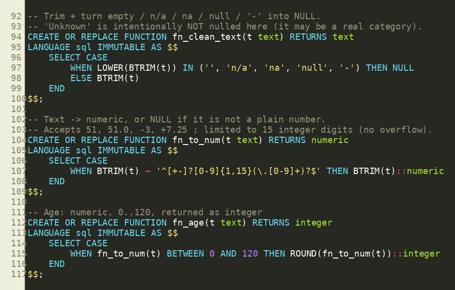
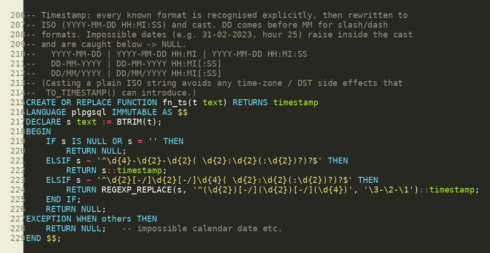
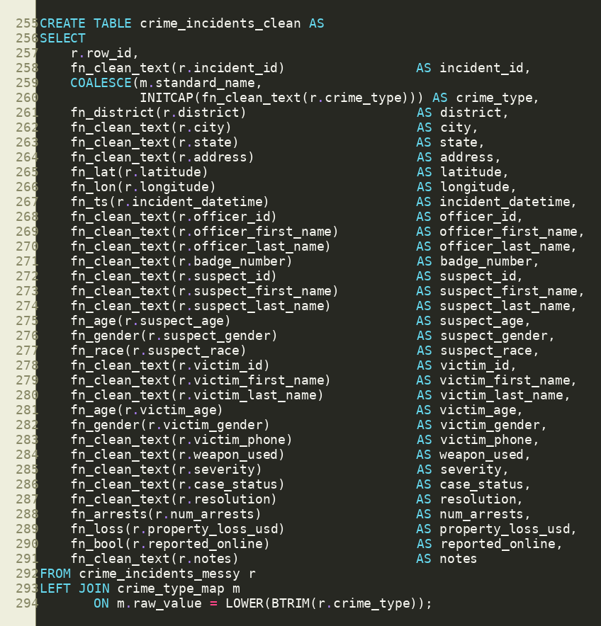
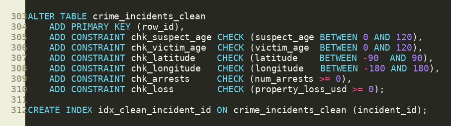
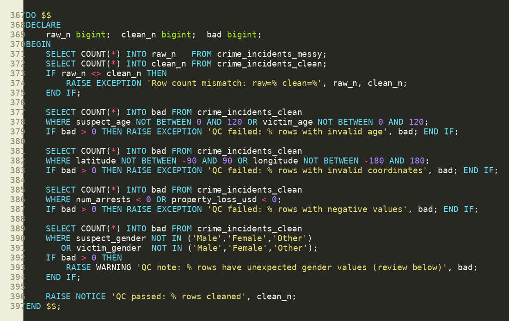

# Crime Incidents: PostgreSQL Data Cleaning Pipeline

A complete, re-runnable PostgreSQL pipeline that takes a messy crime incident CSV (5,250 rows x 33 columns) and turns it into a typed, validated, analysis-ready table, with an audit trail of everything that was changed or rejected.

## What this project demonstrates

- **Layered design**: an untouched raw table, a clean analytical table, a cleaning log, and a reviewed mapping table
- **Safe type conversion**: helper functions that test with a regex *before* casting, so bad text becomes `NULL` instead of crashing the load
- **Standardization**: gender, district, race, boolean, and crime type spellings
- **Multi-format date parsing**: `YYYY-MM-DD`, `DD-MM-YYYY`, and `DD/MM/YYYY`, with or without time; impossible dates become `NULL`
- **Constraints**: `PRIMARY KEY` and `CHECK` rules so the database itself rejects invalid ages, coordinates, arrests, and losses
- **Automatic quality gates**: row-count and range checks that abort and roll back the whole build on failure
- **Auditability**: every rejected raw value is logged with the column and the reason
- **Transactions and savepoints**: all-or-nothing loading and building

## Repository structure

```
crime-incidents-sql-cleaning/
├── README.md
├── LICENSE
├── .gitignore
├── sql/
│   └── crime_incidents_cleaning.sql   # the full pipeline (Parts A, B, C)
├── data/
│   └── README.md                      # where to put the CSV
└── docs/
    ├── data_dictionary.md             # every column and its cleaning rule
    └── images/                        # screenshots of the key code (used in this README)
```

## Requirements

- PostgreSQL 10 or newer (uses `GENERATED ... AS IDENTITY`)
- `psql` command-line client (the script uses `\set` and `\copy`, which only work in `psql`)
- The input file `crime_incidents_messy.csv` placed in the `data/` folder (see [data/README.md](data/README.md))

## How to run

1. Create a database (or use an existing one):
   ```bash
   createdb crime_db
   ```
2. Put `crime_incidents_messy.csv` in the `data/` folder.
3. From the **repository root**, run:
   ```bash
   psql -d crime_db -f sql/crime_incidents_cleaning.sql
   ```
   Add `-U your_user -h localhost` if needed.

To use a different CSV location, edit the `\set csv_path` line near the top of the script (use forward slashes, even on Windows).

> The script stops at the first error (`ON_ERROR_STOP`). The raw table is intentionally **not** dropped on re-run; see the comments in Part A for how to reload.

## Pipeline overview

| Part | What happens | Transaction |
|------|--------------|-------------|
| **A** | Create `crime_incidents_messy` (all `text`), load the CSV, add `row_id`, check the row count is 5,250 | Yes |
| **Profiling** | Read-only counts to inspect duplicates, categories, and odd values | No |
| **B1** | Create helper functions (`fn_clean_text`, `fn_age`, `fn_ts`, ...) | Yes |
| **B2** | Create `crime_type_map` for verified spelling fixes | Yes |
| **B3** | Build `crime_incidents_clean` from the raw table | Yes |
| **B4** | Add primary key, `CHECK` constraints, and index | Yes |
| **B5** | Build `crime_incidents_cleaning_log` of rejected values | Yes |
| **B6** | Run quality gates (abort on failure) | Yes |
| **B7** | Review queries, then `COMMIT` | Yes |
| **C** | `VACUUM ANALYZE` | No |

## Key code at a glance

The five pieces of the script that do the most important work. Line numbers match `sql/crime_incidents_cleaning.sql`.

**1. Safe-cast helpers.** A regex test runs *before* every cast, so bad text becomes `NULL` instead of crashing the build.



**2. Multi-format date parser.** Recognises ISO and day-first formats, rewrites them to ISO, and returns `NULL` for impossible dates.



**3. Building the clean table.** The raw table is only read; every column goes through its cleaning function.



**4. Constraints.** The database itself enforces valid ages, coordinates, arrests, and losses.



**5. Quality gates.** Any failure raises an exception and rolls back the whole build.



## Output tables

| Table | Purpose |
|-------|---------|
| `crime_incidents_messy` | Raw audit layer. All `text`, never edited |
| `crime_incidents_clean` | Typed and validated analytical table (one row per raw row) |
| `crime_incidents_cleaning_log` | Each raw value rejected and set to `NULL`, with column and reason |
| `crime_type_map` | Reviewed mapping of misspelled crime types to standard names |

## Cleaning rules (summary)

| Area | Rule |
|------|------|
| Text columns | Trimmed; `''`, `n/a`, `na`, `null`, `-` become `NULL` |
| Ages | Numeric, 0 to 120, stored as integer; otherwise `NULL` |
| Coordinates | Latitude -90 to 90, longitude -180 to 180, 6 decimals |
| Dates | Three families of formats parsed explicitly (day before month); impossible dates become `NULL` |
| Arrests | Whole number, 0 or more |
| Property loss | 0 or more, 2 decimals |
| Gender | `m/male` to `Male`, `f/female` to `Female`, `other` to `Other`, unknown to `NULL` |
| District | Abbreviations mapped (`nor` to `North`, `sou` to `South`); standard names capitalized |
| Boolean | `true/t/yes/y/1` and `false/f/no/n/0`; anything else `NULL` |
| Crime type | Verified fixes via `crime_type_map`; everything else `INITCAP` (not guessed) |
| Duplicates | `incident_id` is **not** unique. Duplicates are reported, not deleted |

Full column-by-column detail is in [docs/data_dictionary.md](docs/data_dictionary.md).

## Example analysis queries

After the pipeline runs, try these on `crime_incidents_clean`:

```sql
-- Incidents by crime type
SELECT crime_type, COUNT(*) AS incidents
FROM crime_incidents_clean
GROUP BY crime_type
ORDER BY incidents DESC;

-- Monthly trend
SELECT DATE_TRUNC('month', incident_datetime)::date AS month, COUNT(*) AS incidents
FROM crime_incidents_clean
WHERE incident_datetime IS NOT NULL
GROUP BY 1
ORDER BY 1;

-- Average property loss by crime type
SELECT crime_type,
       COUNT(property_loss_usd)           AS rows_with_loss,
       ROUND(AVG(property_loss_usd), 2)   AS avg_loss_usd
FROM crime_incidents_clean
GROUP BY crime_type
ORDER BY avg_loss_usd DESC NULLS LAST;

-- Incidents per district, with share of total
SELECT district, COUNT(*) AS incidents,
       ROUND(100.0 * COUNT(*) / SUM(COUNT(*)) OVER (), 1) AS pct
FROM crime_incidents_clean
GROUP BY district
ORDER BY incidents DESC;

-- How much data was rejected, per column
SELECT column_name, COUNT(*) AS values_set_to_null
FROM crime_incidents_cleaning_log
GROUP BY column_name
ORDER BY values_set_to_null DESC;
```

## Extending the pipeline

- **New spelling fix:** add a row to `crime_type_map` (only after confirming it in the profiling output), or use the optional manual-fix block at the bottom of the script.
- **Deduplicate:** decide a policy first, then enable the commented `crime_incidents_deduped` view (keeps the lowest `row_id` per `incident_id`).
- **New validation rule:** add a `CHECK` constraint in B4 and a matching check in B6.


